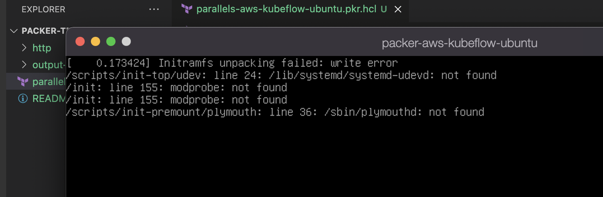

## Notes

- [Build Base Boxes with Packer](https://parallels.github.io/vagrant-parallels/docs/boxes/packer.html)
- [github/chef/bentu/packer_templates/ubuntu](https://github.com/chef/bento/tree/main/packer_templates/ubuntu)
- [Install Kubeflow](https://www.kubeflow.org/docs/distributions/aws/deploy/install-kubeflow/)
- [Parallels Builder (from an ISO)](https://www.packer.io/docs/builders/parallels/iso)
- [Ubuntu Installation Guide](https://help.ubuntu.com/20.04/installation-guide/arm64/install.en.pdf)

The packer build currently fails do to the following:

The resolution could be using more ram: [Initramfs unpacking failed write error](https://www.reddit.com/r/freenas/comments/gljoes/initramfs_unpacking_failed_write_error/)